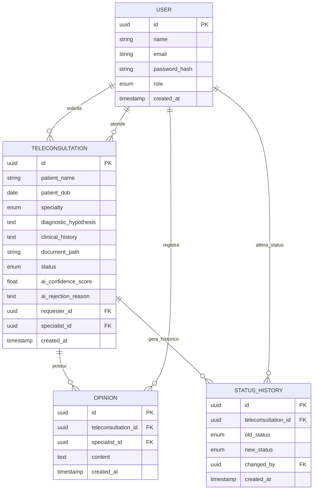

# case-PS-ReNTAI

Plataforma de teleconsultorias médicas que conecta profissionais de saúde a especialistas remotos, cobrindo o ciclo completo: solicitação, validação inteligente de documentos via IA, emissão de pareceres e acompanhamento em tempo real.

## 1. Arquitetura da Solução e Stack
O sistema foi arquitetado para ser moderno, assíncrono e tipado de ponta a ponta. 

* **Backend:** FastAPI + Python. Escolhido pelo suporte nativo a operações assíncronas que é essencial para chamadas de IA, WebSockets e geração automática de documentação OpenAPI.
* **Banco de Dados:** PostgreSQL.
* **Frontend:** React + Vite + TypeScript.
* **Infraestrutura:** Containerização com Docker.

---
Para garantir rastreabilidade das decisões de design e documentar trade-offs, este projeto utiliza Architecture Decision.
Você pode conferir os detalhes na pasta /docs/adrs:
* [Escolha do framework backend](docs/adr/001-escolha-do-framework-backend.md)
* [Escolha do sistema de autenticação](docs/adr/002-autenticacao.md)
* [Escolha da arquitetura](docs/adr/003-arquitetura.md)

---

Diagrama ER do banco de dados:

## 2. Instruções de Execução
O projeto utiliza Docker para garantir que o ambiente seja replicável sem necessidade de instalar dependências locais.
1. Certifique-se de ter o Docker e o Docker Compose instalados.
2. Clone o repositório e navegue até a raiz.
3. Crie um arquivo `.env` na raiz baseado no `.env.example`.
4. Execute o comando: `docker compose up --build`
5. Acesse a aplicação:
   - **Frontend:** http://localhost:3000
   - **Backend/Swagger:** http://localhost:8000/docs

## 3. Configuração do Serviço de Validação de IA
A validação de documentos utiliza uma abordagem híbrida (OCR + pypdf) combinada com a API do OpenRouter (LLM). 
* **Para configurar a LLM:** Altere a variável `OPENROUTER_API_KEY` no `.env`.
* **Substituição:** A lógica está isolada em `backend/ai_service.py`. Para trocar o OpenRouter pela OpenAI, basta alterar o endpoint e o payload dentro da função `validate_document`, mantendo a assinatura da função intacta. O sistema possui fallback automático caso a chave não seja configurada.

### Validação por Área (Especialidade Médica)
A validação realizada pela IA analisa minuciosamente se o documento submetido corresponde à especialidade da teleconsultoria solicitada:
* **Regra de Pertinência:** O documento anexado deve ser compatível com a área da teleconsulta. Por exemplo, se a teleconsulta for de **Cardiologia** e o documento submetido for de **Odontologia**, a IA identificará a divergência técnica e recusará o caso (alterando o status para `CANCELADA` com a justificativa de rejeição).
* **Arquivos de Amostra para Testes:** Há documentos de amostra em formato PDF gerados por IA. Eles estão disponíveis na pasta [sample_documents](sample_documents) na raiz do repositório:
  * [laudo_cardiologia.pdf](sample_documents/laudo_cardiologia.pdf)
  * [laudo_cirurgia_geral.pdf](sample_documents/laudo_cirurgia_geral.pdf)
  * [laudo_doencas_raras.pdf](sample_documents/laudo_doencas_raras.pdf)
  * [laudo_odontologia.pdf](sample_documents/laudo_odontologia.pdf)
  
  Você pode utilizar esses arquivos para testar fluxos bem-sucedidos (enviando a amostra correspondente à área) ou cruzar arquivos diferentes (ex: enviar a amostra de odontologia para uma solicitação de cardiologia) para testar a rejeição automática pela IA.

## 4. Como testar o fluxo completo
1. Acesse o Frontend em `http://localhost:3000`.
2. Registre um usuário com o papel `SOLICITANTE` e faça login.
3. No Dashboard, clique em "Nova Teleconsultoria", preencha o formulário clínico, anexe um arquivo e clique em "Confirmar e Analisar com IA".
4. O frontend exibirá a tela de carregamento "Análise de IA ReNTAI" com um botão "Retornar ao menu". O backend registrará a consulta como `PENDENTE` e executará a validação da IA em segundo plano (*background task*).
5. Se você aguardar na tela de carregamento, o frontend atualizará e fechará o modal automaticamente assim que o processamento terminar. Caso clique em "Retornar ao menu", você poderá ver o status da teleconsultoria atualizando de `PENDENTE` para `EM_ANDAMENTO` ou `CANCELADA` no painel principal.
6. Se o documento for validado com sucesso pela IA (score >= 0.85), o caso passará para `EM_ANDAMENTO`. Se for recusado (score < 0.85), passará para `CANCELADA` e você poderá clicar no caso para ler o motivo detalhado da rejeição emitido pela IA.
7. Registre ou faça login com um usuário de papel `ESPECIALISTA`. Acesse os detalhes da teleconsultoria em status `EM_ANDAMENTO` e envie um parecer para alterá-la automaticamente para `CONCLUIDA`.
8. **Sininho de Notificações:** Durante a sessão, as notificações (como aprovação/rejeição de IA ou parecer de especialista) se acumulam no sininho da barra superior em tempo real. Abrir o sininho zera a contagem e as notificações persistem localmente por usuário, expirando automaticamente após 7 dias.

## 5. Recursos Avançados de UX e Notificações
O sistema foi aprimorado com funcionalidades focadas na facilidade de uso médico:
* **Visualização Web Inline de Documentos:** Permite visualizar arquivos em formato PDF e imagens clínicas diretamente no modal de detalhes da teleconsulta sem downloads automáticos obrigatórios.

* **Sininho de Notificações Inteligente:** Painel acumulador de eventos recebidos em tempo real via WebSocket. Zera a contagem de não lidas ao abrir, fornece navegação imediata ao caso ao clicar e remove automaticamente registros com mais de 7 dias (limpeza baseada em idade de evento, persistida no `localStorage` sob chaves exclusivas de cada usuário logado).

* **Exportação de Resumo em PDF:** Possibilita que médicos solicitantes façam o download de um relatório oficial em formato PDF do resumo de suas teleconsultas concluídas.O arquivo apresenta tabelas de metadados, caixas de destaque coloridas para a análise clínica, histórico, diagnóstico, resumo de IA e pareceres técnicos de especialistas.

## 6. Limitações Conhecidas e Versão de Produção
* **Armazenamento de Arquivos:** No MVP, os arquivos são salvos localmente (`/app/uploads`). Em produção, migraríamos para AWS S3 ou GCS.
* **Migrações:** O SQLAlchemy usa `create_all` para facilitar testes. Em produção, usaria **Alembic**.
* **Fila de Processamento:** O processamento de IA e OCR roda de forma assíncrona usando as `BackgroundTasks` nativas do FastAPI. Em um cenário de produção, substituiria essa fila em memória local por uma fila de mensageria utilizando Celery com Redis ou RabbitMQ.
* **Validação de Cadastro de Médicos:** Em um ambiente de produção, o processo de criação de contas de médicos solicitantes e especialistas exigiria o envio de documentos profissionais (como CRM válido, comprovante de especialização e identificação) passando por uma etapa manual ou automatizada de validação regulatória antes da liberação do acesso. No escopo atual de testes e demonstração do MVP, essa validação regulatória foi abstraída para permitir o cadastro e simulação imediata de fluxos.
* **Distribuição de consultas para especialistas:** No escopo do MVP, a associação entre a teleconsulta e o médico especialista é simplificada. Em um cenário de produção, seria implementado um algoritmo de balanceamento de carga de trabalho  para atribuir automaticamente o caso a um médico especialista qualificado e ativo na fila correspondente assim que o status mudasse para `EM_ANDAMENTO`.

## 7. Ferramentas de IA utilizadas

Neste projeto, adotei assistentes de inteligência artificial estritamente como ferramentas para aumento de produtividade e otimização de tempo. Todas as decisões de arquitetura, regras de negócio e validações de segurança foram concebidas por mim, utilizando as IAs sob orientação e constante revisão de código, em duas frentes:

### 1. Gemini 3.1 Pro (Browser)
* **Atuação:** Utilizado na fase de setup para gerar a base de tipagem dos schemas Pydantic e o mapeamento objeto-relacional (ORM), partindo da modelagem de banco de dados que projetei previamente. Também o direcionei para a montagem dos arquivos de configuração inicial do Docker.
* **Orientação:** Conduzi as interações através de prompts incrementais e contextuais. Em vez de pedir soluções abertas, forneci os logs e a estrutura desejada, exigindo aderência aos padrões de tipagem que defini.
* **Avaliação:** A ferramenta foi excelente para reduzir o trabalho braçal de infraestrutura. Porém exigiu minha supervisão ativa e refatoração manual para corrigir "alucinações" em versões de dependências, além de ajustar lógicas redundantes que a IA tentava refazer códigos que já haviam na arquitetura existente.

### 2. Antigravity - Agente Integrado na IDE (Gemini 3.5 Flash)
Operei este agente autônomo como um assistente de execução focado na IDE. A partir das especificações de requisitos e fluxos de usuário que desenhei, deleguei e supervisionei a codificação das seguintes entregas:
* **Segregação de Perfis Médicos:**
  * **Banco de dados e API:** Instruí o agente a implementar as travas de segurança nas rotas e a injeção do campo `specialty`, revisando posteriormente as regras de autorização para garantir que os especialistas tivessem acesso estrito apenas aos seus casos (`EM_ANDAMENTO`/`CONCLUIDA`).
  * **Interface do Usuário (UI):** Orientei a construção dos componentes condicionais da UI (ocultação de botões). Para otimizar a experiência médica, recusei abordagens via popups e direcionei o agente a criar um formulário inline para o registro de pareceres na tela de detalhes, mantendo o contexto clínico visível.
* **Notificações em Tempo Real (WebSockets):**
  * Projetei a arquitetura da comunicação em tempo real e utilizei o agente para acelerar a codificação do pipeline WebSocket.
  * Solicitei a criação do sistema visual de Toasts, validando pessoalmente os gatilhos para garantir que o dashboard reagisse instantaneamente a aprovações e novos pareceres sem a necessidade de polling.
* **Filtros Temporais Avançados:** Especifiquei os critérios de negócio para os filtros temporais avançados, delegando ao agente apenas a implementação visual e as validações de fuso horário.
* **Depuração e Garantia de Qualidade:**
  * Utilizei o contexto profundo da ferramenta para rastrear e solucionar problemas de concorrência que diagnostiquei em Refs do React e no fechamento de conexões WebSocket.
  * Direcionei o agente na resolução de bugs de importação e exportação de módulos e componentes, validando pessoalmente o código.
  * Defini os cenários críticos e exigi que o agente escrevesse e executasse scripts de testes automatizados. Revisei o código final para garantir a qualidade do código.